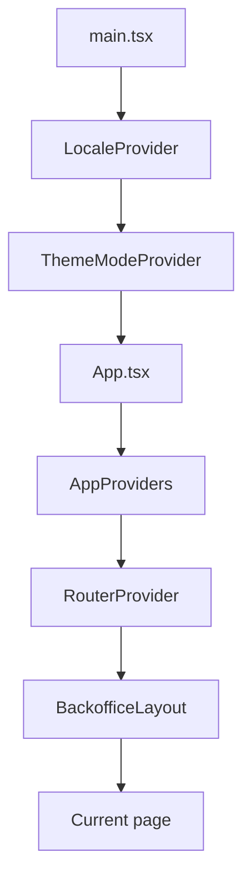

# 03 — Entry point and bootstrap

---

## `src/main.tsx`

**First TypeScript file that runs.**

```tsx
createRoot(document.getElementById('root')!).render(
  <StrictMode>
    <LocaleProvider>
      <ThemeModeProvider>
        <App />
      </ThemeModeProvider>
    </LocaleProvider>
  </StrictMode>,
)
```

| Piece | Meaning |
|-------|---------|
| `createRoot` | React 18+ render API |
| `StrictMode` | In dev, double-checks suspicious patterns (debug aid) |
| `LocaleProvider` | Language and direction (fa/en, rtl/ltr) — **must wrap MUI theme** |
| `ThemeModeProvider` | dark/light — before App so theme can read it |
| `App` | router and remaining providers |

**Why is Locale so high?** `AppProviders` needs `direction`; `DirectionProvider` lives inside it.

---

## `src/app/App.tsx`

Thin layer:

```tsx
<AppProviders>
  <RouterProvider router={router} />
</AppProviders>
```

- **`AppProviders`**: MUI theme, Query, Toast, Loading, Confirm
- **`RouterProvider`**: shows the page for the current URL

---

## `src/app/AppProviders.tsx`

**Core wiring** — provider order matters:

```text
DirectionProvider      ← RTL cache for Emotion/MUI
  ThemeProvider        ← MUI theme + CssBaseline
    QueryClientProvider
      ToastProvider
        LoadingProvider
          ConfirmProvider
            {children}
```

| Provider | File | Job |
|----------|------|-----|
| Direction | `DirectionProvider.tsx` | stylis RTL |
| Theme | MUI | colors, typography |
| Query | `queryClient.ts` | TanStack Query |
| Toast | `feedback/toast/` | success/error messages |
| Loading | `feedback/loading/` | backdrop during API calls |
| Confirm | `feedback/confirm/` | confirmation dialog |

`theme` is built with `useMemo` so it only rebuilds when `direction` or `mode` changes.

---

## `src/app/DirectionProvider.tsx`

MUI styles CSS via **Emotion**. For RTL, `stylis-plugin-rtl` must be applied to the cache.

- `direction === 'rtl'` → cache key `muirtl` + rtlPlugin
- `direction === 'ltr'` → cache key `muiltr`

Without this, some margins/paddings do not flip in RTL.

---

## `src/app/queryClient.ts`

Global **QueryClient** defaults:

| Setting | Value | Why |
|---------|-------|-----|
| `retry` (query) | 1 | One retry after failure |
| `refetchOnWindowFocus` | false | No refetch when tab regains focus |
| `staleTime` | 30 seconds | Data considered fresh |
| `retry` (mutation) | 0 | Do not auto-retry POST/PUT/DELETE |

---

## `src/app/router.tsx`

**Routes** via `createBrowserRouter`:

```text
BackofficeLayout (always)
├── /                          → DashboardPage
├── /management/people         → PeopleListPage
├── /management/people/new     → PersonCreatePage
├── /management/people/:id/edit → PersonEditPage
├── /management/roles          → PlaceholderPage
├── /management/users          → PlaceholderPage
├── /reports                   → PlaceholderPage
├── /settings/general          → PlaceholderPage
├── /settings/security         → PlaceholderPage
└── /dev                       → DevPage (test tools)
```

- **`BackofficeLayout`**: Sidebar + Header + `<Outlet />` for child content
- **`:id`**: dynamic param — read in `PersonEditPage` with `useParams()`

New page = one import + one `{ path, element }` line.

---

## Provider diagram



---

## Next

→ [04-api-layer.md](./04-api-layer.md)
